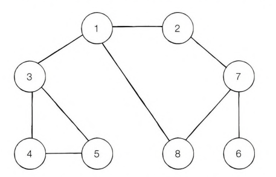

# 1. 자료구조 기초

## 자료구조란?

### 탐색

많은 양의 데이터 중에서 원하는 데이터를 찾는 과정

### 자료구조

데이터를 표현하고 관리하고 처리하기 위한 구조

<br/>

## 스택

> 박스 쌓기

- 선입후출 (FILO)
- 후입선출 (LIFO)

<br/>

> 별도 라이브러리 필요X

- 삽입: `append()`
- 삭제: `pop()`

```
#삽입(5) - 삽입(2) - 삽입(3) - 삽입(7) - 삭제() - 삽입(1) - 삽입(4) - 삭제()

stack = []

stack.append(5)
stack.append(2)
stack.append(3)
stack.append(7)
stack.popO
stack.append()
stack.append(4)
stack.pop()

print(stack) # 최하단 원소부터 출력
print(stack[：：-1 ]) # 최상단 원소부터 출력
```

<br/>

## 큐

> 대기줄

- 선입선출 (FIFO)

<br/>

> collections 모듈의 deque 라이브러리 사용
> `from collections import deque`

- `deque`: 스택과 큐의 장점을 모두 채택택
- `list()`: deque 객체를 리스트 자료형으로 변경

<br/>

```
# 삽입(5) - 삽입(2) - 삽입(3) - 삽입(7) - 삭제() - 삽입(1) - 삽입(4) - 삭제()

from collections import deque

queue = dequeO

queue.append(5)
queue.append(2)
queue.append(3)
queue.append(7)
queue.popleft()
queue.append(1)
queue.append(4)
queue.popleft()

print(queue) # 먼저 들어온 순서대로 출력
queue.reverse() # 다음 출력을 위해 역순으로 바꾸기
print(queue) # 나중에 들어온 원소부터 출력
```

<br/>

## 재귀 함수

### 재귀 함수란?

자기 자신을 다시 호출하는 함수

```
def recursive_function()：
    print(‘재귀 함수를 호출합니다.‘)
    recursive_function()

recursive_function()
```

- '재귀 함수를 호출합니다' 문자열 무한 출력
- `recursive_function()`이 자기 자신을 계속해서 추가로 불러오기 때문

`RecursionError： maximum recursion depth exceeded while pickling an object`

- 재귀의 최대 깊이를 초과했다는 오류
- 무한대로 재귀 호출 진행 X

### 재귀 함수의 종료 조건

재귀 함수를 사용할 때에는 재귀 함수가 언제 끝날지, 그 종료 조건을 꼭 명시해야 함 (무한 호출 방지)

```
def recursive_function(i)：
    # 100번째 출력했을 때 종료되도록 종료 조건 명시
    if i == 100：
        return

    print(i, '번째 재귀 함수에서', i + 1, '번째 재귀 함수를 호출합니다.’)
    recursive_function(i 수 1)
    print(i, ’번째 재귀 함수를 종료합니다.')

recursive_function(1)
```

<br/>

- 컴퓨터 내부에서 재귀 함수의 수행은 **스택 자료구조** 이용
- 함수를 계속 호출했을 때 가장 마지막에 호출한 함수가 먼저 수행을 끝내야 그 앞의 함수 호출이 종료되기 때문 (LIFO)

### 재귀함수 대표 예제: 팩토리얼 문제

```
# 반복적으로 구현한 n!
def factorial_iterative(n)：
    result = 1
        # 1부터 n까지의 수를 차례대로 곱하기
    for i in range(1, n+1)：
        result *= i
    return result


# 재귀적으로 구현한 n!
def factorial_recursive(n)：
    if n <= 1： # n이 1 이하인 경우 1 반환
        return 1
    # n! = n * (n-1)! 를 그대로 코드로 작성하기
    return n * factorial_recursive(n - 1)


# 각각의 방식으로 구현한 n! 출력 (n=5)
print('반복적으로 구현:’, factorial_iterative(5))
print(재귀적으로 구현:’, factorial_recursive(5))
```

<br/>

팩토리얼 - 수학적 점화식

> - n이 0 혹은 1일 때 : factorial(n) = 1

> - n이 1보다 클 때 : factorial(n) = n x factorial(n-1)

<br/>
일반적으로 점화식에서 종료 조건을 찾을 수 있다.

- 종료 조건: n이 0 혹은 1일 때
- 팩토리얼은 n이 양의 정수일 때에만 우효함
- n이 1 이하인 경우 1을 반환할 수 있도록 작성해야 함

<br/>

# 2. 탐색 알고리즘 DFS/BFS

## 그래프의 기본 구조

### 그래프 탐색이란?

하나의 노드를 시작으로 다수의 노드를 방문하는 것것

- 노드 (정점)
- 간선

> 두 노드가 간선으로 연결되어 있다면 '두 노드는 인접하다'고 표현

그래프는 2가지 방식으로 표현 가능

- 인접 행렬 : 2차원 배열로 그래프의 연결 관계를 표현하는 방식
- 인접 리스트 : 리스트로 그래프의 연결 관계를 표현하는 방식

<br/>

### 인접 행렬 방식

2차원 배열에 각 노드가 연결된 형태를 기록하는 방식

- 파이썬에서 `2차원 리스트`로 구현
- 연결이 되어 있지 않은 노드끼리는 무한의 비용이라고 작성 (매우 큰 수로 초기화)

```
INF = 999999999 # 무한의 비용 선언

# 2차원 리스트를 이용해 인접 행렬 표현

graph = [
    [0, 7, 5],
    [7, 0, INF]
    [5, INF, 0]
]

print(graph)
```

<br/>

### 인접 리스트 방식

모든 노드에 연결된 노드에 대한 정보를 차례대로 연결하여 저장하는 방식

- `연결 리스트`로 구현
- 파이썬에서는 리스트 자료형 `append()` 등등 기본 제공하므로 단순히 2차원 리스트를 이용해 구현

```
# 행(Row)이 3개인 2차원 리스트로 인접 리스트 표현
graph = [[] for _ in range(3)]

# 노드 0에 연결된 노드 정보 저장(노드, 거리)
graph[0].append((1, 7))
graph[0].append((2, 5))

# 노드 1에 연결된 노드 정보 저장(노드, 거리)
graph[1].append((0, 7))

# 노드 2에 연결된 노드 정보 저장(노드, 거리)
graph[2].append((0, 5))

print(graph)
```

<br/>

### 인접 행렬 vs 인접 리스트

**인접 행렬**

- 모든 관계를 저장하므로 노드 개수가 많을수록 메모리가 불필요하게 낭비됨
- 특정 두 노드가 연결되어 있는지에 대한 정보를 얻는 속도가 빠름

**인접 리스트**

- 연결된 정보만을 저장하기 때문에 메모리를 효율적으로 사용함
- 연결된 데이터를 하나씩 확인해야 하므로 특정 두 노드가 연결되어 있는지에 대한 정보를 얻는 속도가 느림

<br/>

> 특정한 노드와 연결된 모든 인접 노드를 순회해야 하는 경우, 인접 리스트 방식이 인접 행렬 방식에 비해 메모리 공간의 낭비가 적다.

<br/>

## DFS

깊이 우선 탐색 (Depth-First Search)

> 특정한 경로로 탐색하다가 특정한 상황에서 최대한 깊숙이 들어가서 노드를 방문한 후, 다시 돌아가 다른 경로로 탐색하는 알고리즘

<br/>

- `스택` 자료구조 사용
- 재귀 함수 사용

<br/>

1. 탐색 시작 노드를 스택에 삽입하고 방문 처리를 한다.
2. 스택의 최상단 노드에 방문하지 않은 인접 노드가 있으면 그 인접 노드를 스택ㅇ 넣고 방문 처리를 한다. 방문하지 않은 인접 노드가 없으면 스택에서 최상단 노드를 꺼낸다.
3. 1, 2번의 과정을 더 이상 수행할 수 없을 때까지 반복한다.

<br/>


1 - 2 - 7 - 6 - 8 - 3 - 4 - 5

```
# DFS 메서드 정의
def dfs(graph, v, visited)：
    # 현재 노드를 방문 처리
    visited[v] = True
    print(v, end=' ')
    # 현재 노드와 연결된 다른 노드를 재귀적으로 방문
    for i in graph[v]：
        if not visited[i]：
            dfs(graph, i, visited)

# 각 노드가 연결된 정보를 리스트 자료형으로 표현 2차원 리스트）
graph = [
    [],
    [2, 3, 8],
    [1, 7],
    [1, 4, 5],
    [3, 5],
    [3, 4],
    [7],
    [2, 6, 8],
    [1, 7]
]

# 각 노드가 방문된 정보를 리스트 자료형으로 표현 1차원 리스트）
visited = [False] * 9

# 정의된 DFS 함수 호출
dfs(graph, 1, visited)
```

<br/>

## BFS

너비 우선 탐색 (Breadth-First Search)

> 가까운 노드부터 탐색하는 알고리즘

<br/>

- `큐` 자료구조 사용
- DFS보다 좀 더 빠르게 동작

<br/>

1. 탐색 시작 노드를 큐에 삽입하고 방문 처리를 한다.
2. 큐에서 노드를 꺼내 해당 노드의 인접 노드 중에서 방문하지 않은 노드를 모두 큐에 삽입하고 방문 처리를 한다.
3. 1, 2번의 과정을 더 이상 수행할 수 없을 때까지 반복한다.

<br/>


1 - 2 - 3 - 8 - 7 - 4 - 5 - 6

```
from collections import deque

# BFS 메서드 정의
def bfs(graph, start, visited)：
    # 큐(Queue) 구현을 위해 deque 라이브러리 사용
    queue = deque([start])
    # 현재 노드를 방문 처리
    visited[start] = True
    # 큐가 빌 때까지 반복
    hile queue：
        # 큐에서 하나의 원소를 뽑아 출력
    V = queue.popleftO
    print(v, end=' ')
    # 해당 원소와 연결된, 아직 방문하지 않은 원소들을 큐에 삽입
    for i in graph[v]：
        if not visited[i]：
            queue.append(i)
            visited[i] = True

# 각 노드가 연결된 정보를 리스트 자료형으로 표현(2차원 리스트)
graph = [
    [],
    [2, 3, 8],
    [1, 7],
    [1, 4, 5],
    [3, 5],
    [3, 4],
    [7],
    [2, 6, 8],
    [1, 7]
]

# 각 노드가 방문된 정보를 리스트 자료형으로 표현 1차원 리스트）
visited = [False] * 9

# 정의된 BFS 함수 호출
bfs(graph, 1, visited)
```
